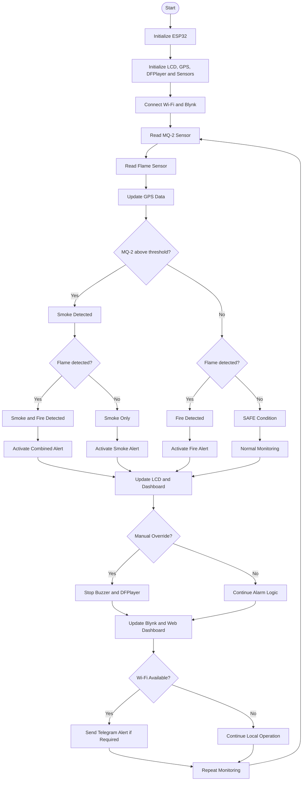

# System Flowchart

```mermaid
flowchart TD
    A([Start]) --> B[Initialize ESP32]
    B --> C[Initialize LCD, GPS, DFPlayer and Sensors]
    C --> D[Connect Wi-Fi and Blynk]
    D --> E[Read MQ-2 Sensor]
    E --> F[Read Flame Sensor]
    F --> G[Update GPS Data]
    G --> H{MQ-2 above threshold?}
    
    H -->|Yes| I[Smoke Detected]
    H -->|No| J{Flame detected?}
    
    I --> K{Flame detected?}
    J -->|Yes| L[Fire Detected]
    J -->|No| M[SAFE Condition]
    
    K -->|Yes| N[Smoke and Fire Detected]
    K -->|No| O[Smoke Only]
    
    L --> P[Activate Fire Alert]
    N --> Q[Activate Combined Alert]
    O --> R[Activate Smoke Alert]
    M --> S[Normal Monitoring]
    
    P --> T[Update LCD and Dashboard]
    Q --> T
    R --> T
    S --> T
    
    T --> U{Manual Override?}
    U -->|Yes| V[Stop Buzzer and DFPlayer]
    U -->|No| W[Continue Alarm Logic]
    
    V --> X[Update Blynk and Web Dashboard]
    W --> X
    
    X --> Y{Wi-Fi Available?}
    Y -->|Yes| Z[Send Telegram Alert if Required]
    Y -->|No| AA[Continue Local Operation]
    
    Z --> AB[Repeat Monitoring]
    AA --> AB
    AB --> E
```
