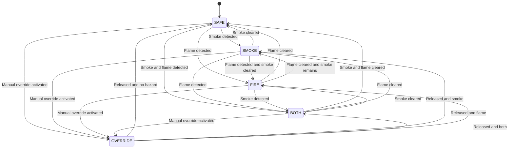

# State Machine Diagram

```mermaid
stateDiagram-v2
    [*] --> SAFE

    SAFE --> SMOKE: Smoke detected
    SAFE --> FIRE: Flame detected
    SAFE --> BOTH: Smoke and flame detected

    SMOKE --> SAFE: Smoke cleared
    SMOKE --> FIRE: Flame detected and smoke cleared
    SMOKE --> BOTH: Flame detected

    FIRE --> SAFE: Flame cleared
    FIRE --> SMOKE: Flame cleared and smoke remains
    FIRE --> BOTH: Smoke detected

    BOTH --> SAFE: Smoke and flame cleared
    BOTH --> SMOKE: Flame cleared
    BOTH --> FIRE: Smoke cleared

    SAFE --> OVERRIDE: Manual override activated
    SMOKE --> OVERRIDE: Manual override activated
    FIRE --> OVERRIDE: Manual override activated
    BOTH --> OVERRIDE: Manual override activated

    OVERRIDE --> SAFE: Released and no hazard
    OVERRIDE --> SMOKE: Released and smoke
    OVERRIDE --> FIRE: Released and flame
    OVERRIDE --> BOTH: Released and both
```
