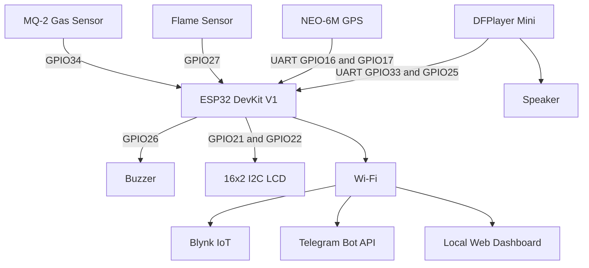

# System Architecture

```mermaid
flowchart TD
    A[MQ-2 Gas Sensor] -->|GPIO34| E[ESP32 DevKit V1]
    B[Flame Sensor] -->|GPIO27| E

    E -->|GPIO26| F[Buzzer]
    E -->|GPIO21 and GPIO22| G[16x2 I2C LCD]
    H[NEO-6M GPS] -->|UART GPIO16 and GPIO17| E
    I[DFPlayer Mini] -->|UART GPIO33 and GPIO25| E
    I --> J[Speaker]

    E --> K[Wi-Fi]
    K --> L[Blynk IoT]
    K --> M[Telegram Bot API]
    K --> N[Local Web Dashboard]
```
